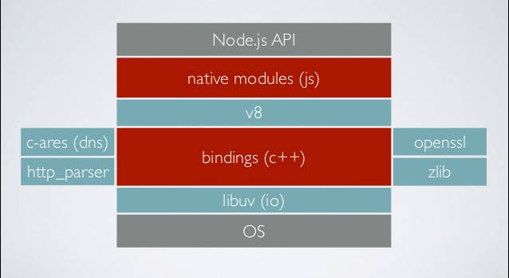
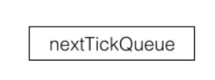
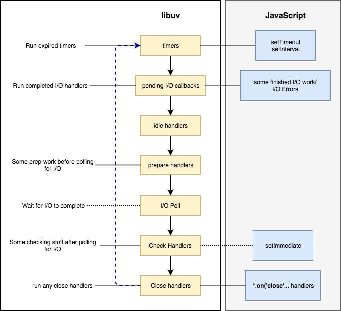
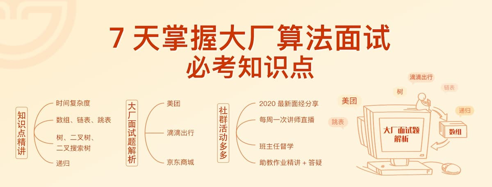

<br />

<br />

<br />

JavaScript 是单线程运行，异步操作特别重要。

只要用到引擎之外的功能，就需要跟外部交互，从而形成异步操作。由于异步操作实在太多，JavaScript 不得不提供很多异步语法。这就好比，有些人老是受打击， 他的抗打击能力必须变得很强，否则他就完蛋了。

Node 的异步语法比浏览器更复杂，因为它可以跟内核对话，不得不搞了一个专门的库 [libuv](http://thlorenz.com/learnuv/book/history/history_1.html) 做这件事。这个库负责各种回调函数的执行时间，毕竟异步任务最后还是要回到主线程，一个个排队执行。



为了协调异步任务，Node 居然提供了四个定时器，让任务可以在指定的时间运行。

> setTimeout() setInterval() setImmediate() process.nextTick()

**前两个是语言的标准，后两个是 Node 独有的**。它们的写法差不多，作用也差不多，不太容易区别。

你能说出下面代码的运行结果吗？

<br />

```javascript
(() => console.log(5))();
process.nextTick(() => console.log(3));
Promise.resolve().then(() => console.log(4));
setTimeout(() => console.log(1));
setImmediate(() => console.log(2));
```

运行结果如下。

$ node test.js
5
3
4
1
2

如果你能一口说对，可能就不需要再看下去了。本文详细解释，Node 怎么处理各种定时器，或者更广义地说，libuv 库怎么安排异步任务在主线程上执行。

### 一、同步任务和异步任务

首先，同步任务总是比异步任务更早执行。

前面的那段代码，只有最后一行是同步任务，因此最早执行。

### 二、本轮循环和次轮循环

异步任务可以分成两种。

> 追加在本轮循环的异步任务 追加在次轮循环的异步任务

所谓"循环"，指的是事件循环（event loop）。这是 JavaScript 引擎处理异步任务的方式，后文会详细解释。这里只要理解，本轮循环一定早于次轮循环执行即可。

<br />

> 💡 Node 规定，`process.nextTick`和`Promise`的回调函数，追加在本轮循环，即同步任务一旦执行完成，就开始执行它们。

<br />

> 💡 而`setTimeout`、`setInterval`、`setImmediate`的回调函数，追加在次轮循环。

<br />

这就是说，文首那段代码的第三行和第四行，一定比第一行和第二行更早执行。

> // 下面两行，次轮循环执行
> setTimeout(() => console.log(1));
> setImmediate(() => console.log(2));
> // 下面两行，本轮循环执行
> process.nextTick(() => console.log(3));
> Promise.resolve().then(() => console.log(4));

### 三、process.nextTick()

`process.nextTick`这个名字有点误导，它是在本轮循环执行的，而且是**所有异步任务里面最快执行的。**



**Node 执行完所有同步任务，接下来就会执行\*\***`process.nextTick`\*\* **的任务队列。**所以，下面这行代码是第二个输出结果。

基本上，如果你希望异步任务尽可能快地执行，那就使用`process.nextTick`。

### 四、微任务

根据语言规格，`Promise`对象的回调函数，会进入异步任务里面的"微任务"（microtask）队列。

微任务队列追加在`process.nextTick`队列的后面，也属于本轮循环。所以，下面的代码总是先输出`3`，再输出`4`。

> process.nextTick(() => console.log(3));
> Promise.resolve().then(() => console.log(4));
> // 3
> // 4


注意，只有前一个队列全部清空以后，才会执行下一个队列。

> process.nextTick(() => console.log(1));
> Promise.resolve().then(() => console.log(2));
> process.nextTick(() => console.log(3));
> Promise.resolve().then(() => console.log(4));
> // 1
> // 3
> // 2
> // 4

上面代码中，全部`process.nextTick`的回调函数，执行都会早于`Promise`的。

至此，本轮循环的执行顺序就讲完了。

> 同步任务 process.nextTick() 微任务

### 五、事件循环的概念

下面开始介绍次轮循环的执行顺序，这就必须理解什么是事件循环（event loop）了。

Node 的[官方文档](https://nodejs.org/en/docs/guides/event-loop-timers-and-nexttick/)是这样介绍的。

> "When Node.js starts, it initializes the event loop, processes the provided input script which may make async API calls, schedule timers, or call process.nextTick(), then begins processing the event loop."

这段话很重要，需要仔细读。它表达了三层意思。

首先，有些人以为，除了主线程，还存在一个单独的事件循环线程。不是这样的，只有一个主线程，事件循环是在主线程上完成的。

其次，Node 开始执行脚本时，会先进行事件循环的初始化，但是这时事件循环还没有开始，会先完成下面的事情。

> 同步任务 发出异步请求 规划定时器生效的时间 执行 process.nextTick()等等

最后，上面这些事情都干完了，事件循环就正式开始了。

### 六、事件循环的六个阶段

事件循环会无限次地执行，一轮又一轮。只有异步任务的回调函数队列清空了，才会停止执行。

每一轮的事件循环，分成六个阶段。这些阶段会依次执行。

> timers I/O callbacks idle, prepare poll check close callbacks

每个阶段都有一个先进先出的回调函数队列。只有一个阶段的回调函数队列清空了，该执行的回调函数都执行了，事件循环才会进入下一个阶段。


下面简单介绍一下每个阶段的含义，详细介绍可以看[官方文档](https://nodejs.org/en/docs/guides/event-loop-timers-and-nexttick/)，也可以参考 libuv 的[源码解读](https://jsblog.insiderattack.net/handling-io-nodejs-event-loop-part-4-418062f917d1)。

**（1）timers**

这个是定时器阶段，处理`setTimeout()`和`setInterval()`的回调函数。进入这个阶段后，主线程会检查一下当前时间，是否满足定时器的条件。如果满足就执行回调函数，否则就离开这个阶段。

**（2）I/O callbacks**

除了以下操作的回调函数，其他的回调函数都在这个阶段执行。

> setTimeout()和 setInterval()的回调函数 setImmediate()的回调函数 用于关闭请求的回调函数，比如 socket.on('close', ...)

**（3）idle, prepare**

该阶段只供 libuv 内部调用，这里可以忽略。

**（4）Poll**

这个阶段是轮询时间，用于等待还未返回的 I/O 事件，比如服务器的回应、用户移动鼠标等等。

这个阶段的时间会比较长。如果没有其他异步任务要处理（比如到期的定时器），会一直停留在这个阶段，等待 I/O 请求返回结果。

**（5）check**

该阶段执行`setImmediate()`的回调函数。

**（6）close callbacks**

该阶段执行关闭请求的回调函数，比如`socket.on('close', ...)`。

### 七、事件循环的示例

下面是来自官方文档的一个示例。

> const fs = require('fs');

const timeoutScheduled = Date.now();

// 异步任务一：100ms 后执行的定时器
setTimeout(() => {
const delay = Date.now() - timeoutScheduled;
console.log(`${delay}ms`);
}, 100);

// 异步任务二：文件读取后，有一个 200ms 的回调函数
fs.readFile('test.js', () => {
const startCallback = Date.now();
while (Date.now() - startCallback < 200) {
// 什么也不做
}
});

上面代码有两个异步任务，一个是 100ms 后执行的定时器，一个是文件读取，它的回调函数需要 200ms。请问运行结果是什么？



脚本进入第一轮事件循环以后，没有到期的定时器，也没有已经可以执行的 I/O 回调函数，所以会进入 Poll 阶段，等待内核返回文件读取的结果。由于读取小文件一般不会超过 100ms，所以在定时器到期之前，Poll 阶段就会得到结果，因此就会继续往下执行。

第二轮事件循环，依然没有到期的定时器，但是已经有了可以执行的 I/O 回调函数，所以会进入 I/O callbacks 阶段，执行`fs.readFile`的回调函数。这个回调函数需要 200ms，也就是说，在它执行到一半的时候，100ms 的定时器就会到期。但是，必须等到这个回调函数执行完，才会离开这个阶段。

第三轮事件循环，已经有了到期的定时器，所以会在 timers 阶段执行定时器。最后输出结果大概是 200 多毫秒。

### 八、setTimeout 和 setImmediate

由于`setTimeout`在 timers 阶段执行，而`setImmediate`在 check 阶段执行。所以，`setTimeout`会早于`setImmediate`完成。

上面代码应该先输出`1`，再输出`2`，但是实际执行的时候，结果却是不确定，有时还会先输出`2`，再输出`1`。

这是因为`setTimeout`的第二个参数默认为`0`。但是实际上，Node 做不到 0 毫秒，最少也需要 1 毫秒，根据[官方文档](https://nodejs.org/api/timers.html#timers_settimeout_callback_delay_args)，第二个参数的取值范围在 1 毫秒到 2147483647 毫秒之间。也就是说，`setTimeout(f, 0)`等同于`setTimeout(f, 1)`。

实际执行的时候，进入事件循环以后，有可能到了 1 毫秒，也可能还没到 1 毫秒，取决于系统当时的状况。如果没到 1 毫秒，那么 timers 阶段就会跳过，进入 check 阶段，先执行`setImmediate`的回调函数。

但是，下面的代码一定是先输出 2，再输出 1。

> const fs = require('fs');

fs.readFile('test.js', () => {
setTimeout(() => console.log(1));
setImmediate(() => console.log(2));
});

上面代码会先进入 I/O callbacks 阶段，然后是 check 阶段，最后才是 timers 阶段。因此，`setImmediate`才会早于`setTimeout`执行。

### 九、参考链接

（完）

[算法训练营体验课](https://u.geekbang.org/subject/prioralgorithm?gk_liebian=false&cus_user_wechat=university&utm_source=ruanyifeng&utm_medium=1010&utm_term=kolruanyifeng1118)



### 相关文章

[https://www.notion.so/wooodhead/73170919728f46f5b985cd6b29ede984?v=7c3cd82afa824904826be95edd7d9578&p=b5fd3d24192846ef9eabcf85d87542d0](https://www.notion.so/wooodhead/73170919728f46f5b985cd6b29ede984?v=7c3cd82afa824904826be95edd7d9578&p=b5fd3d24192846ef9eabcf85d87542d0)
